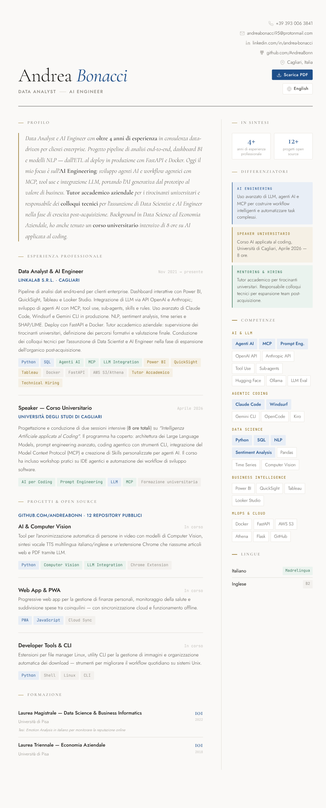

# Andrea Bonacci — Personal CV

Data Analyst & AI Engineer based in Cagliari, Italy.
This repository hosts my interactive CV, built as a static website deployed on GitHub Pages.

## Quick Links

|  | Italian | English |
|---|---|---|
| **Online CV** | [andreabonn.github.io](https://andreabonn.github.io) | [andreabonn.github.io/en.html](https://andreabonn.github.io/en.html) |
| **Download PDF** | [andrea_bonacci_cv.pdf](https://andreabonn.github.io/andrea_bonacci_cv.pdf) | [andrea_bonacci_cv_en.pdf](https://andreabonn.github.io/andrea_bonacci_cv_en.pdf) |

## Preview

  

## Built With

- Semantic HTML5
- CSS custom properties, grid layout, responsive design
- [Cormorant Garamond](https://fonts.google.com/specimen/Cormorant+Garamond), [Jost](https://fonts.google.com/specimen/Jost), [JetBrains Mono](https://fonts.google.com/specimen/JetBrains+Mono) via Google Fonts
- Separate screen/print stylesheets for optimized PDF output (2-page A4)
- No frameworks, no JavaScript dependencies

## License

This project is open source under the [MIT License](LICENSE).
